# Parity inventory — piglet processing against farrowing

**Principle (owner):** all tasks look the same; only the information differs. Every processing screen is mapped to the farrowing screen it must look like, and every structural difference is listed. The fix is the task skeleton ([ADR 0003](../../design-system/adr/0003-task-skeleton.md), `ux/design-system/components/Task*`); the pages are rebuilt on it page by page, next.

- **Reference:** `ux/system/farrowing-astra-concept.html`, single phone, 390×844 (captured from the phone element).
- **Processing:** `ux/tasks/piglet-processing/*.html?state=…` at a 390×844 viewport (what a phone shows).
- **Pairs** are in [`parity/`](parity/): `NN-screen.processing.png` beside `NN-screen.farrowing.png`, both 390×844.
- Taken on `fix/skeleton` from `origin/map/3-piglet-processing` @ `eaff01c`, 2026-09-30.

## What drifted everywhere (read this first)

These hold on every processing page; the per-screen lists below only add what is particular to the screen.

| # | Farrowing | Processing today |
|---|---|---|
| C1 **Presentation** | Always inside the 390×844 phone, with a status bar. | A bare `.phone` column, `max-width: 390px; min-height: 100vh`. In a wider window the page stretches to the window's height and its footer bar pins to the window's bottom edge (retro 32). No status bar. |
| C2 **Where a litter opens** | Tap a row → a **drawer over the room**. The drawer's head is the animal: `000418 ›` (20px), `B1 / Parity 3 · Farrowing` under it, ✕ right. | A **separate page per litter** whose top is a 20px mono `A02 · 000231 ›` over a second line `Parity 3 … day 3` and a divider — a header farrowing has nowhere. Every drawer (dead, count, move, castrate…) then rises over *that* page, not over the room. |
| C3 **Sheet anatomy** | Grab bar · title (20px) · subtitle (11px muted) · ✕ · divider · scrolling body · footer on the bottom edge with Back + primary. | No grab bar, no ✕, no divider under the head. The drawer's title is jammed under the litter header (castrate, dead, move); the subtitle is a body line or missing. Drawers are full-page tall whatever their content. |
| C4 **Exit vocabulary** | **Back** (with a ‹ chevron) in every footer; ✕ in the drawer head. | **Close** on the litter sheet, room filter, find, reviews, receipt, handoff, bulk, edge and id pages; Back elsewhere; never an ✕. |
| C5 **Footer** | 86×48 Back with a chevron + the primary filling the rest; `14 21 28` padding; the handle bar. Alone, Back fills the bar in ink. | Back is a plain outlined word, 86px on some pages and half the bar on others (record page, edit: Back 50% / Edit 50%). A full-width outlined **Close** where farrowing would show Back. Status and receipt lines sit **in the bar above the buttons** (bulk, count explain, bulk receipt). |
| C6 **Rows** | TaskRow: mono id + one chip **under** it · one headline (the figure) · one mono meta line · chevron or ✎. 76px. | Row cards: a mono code left, a **treatment name** as the headline, then two or three lines of red/amber mono meta (`due 2 days ago · Iron 13 owed · males counted as you cut`), and a `• Sow died` status dot on the **right**. 70–110px, uneven. |
| C7 **Tools under the summary** | An outlined tool row: `Edit · Record death · More actions`. | Two big well tiles `Record dead | Set count` (Button `tool` register). |
| C8 **Left edge** | Drawer: head at 18, body/footer at 21. Page: head at 21, body/footer at 18 (farrowing's own inconsistency, see bugs). | 18 on pages, 18 in drawers, panels inset again inside drawers (castrate's `2 deferred · why?` off the column). |

## Screen by screen

Legend: **Counterpart** is the farrowing screen the processing screen must match. *No counterpart* means: compose it from the skeleton parts named, with nothing new.

### 01 · Room (`room.html?state=room`) → farrowing Room list
| Processing | Farrowing |
|---|---|
| 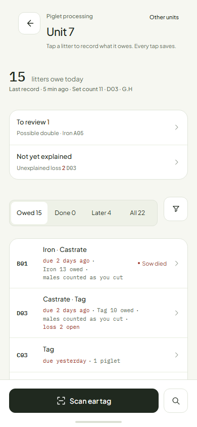 | 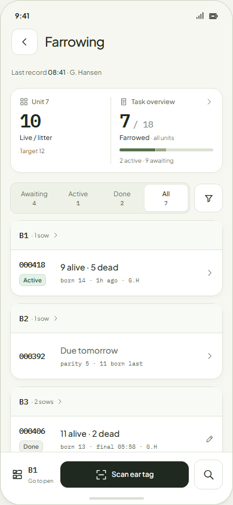 |

- **Header/title:** processing titles the page **`Unit 7`** under a grey eyebrow `Piglet processing`, with an instruction sentence (`Tap a litter to record what it owes. Every tap saves.`) and an `Other units` text action; its back is an arrow (←). Farrowing: ‹ back + **the task's name** (`Farrowing`), nothing else.
- **Last record:** processing leads with a figure line `15 litters owe today`, then `Last record · 5 min ago · Set count 11 · D03 · G.H`. Farrowing: one line, `Last record 08:41 · G. Hansen`.
- **Summary card:** absent. Farrowing's two-half card (unit figure | task overview with the progress bar) is missing; the task overview is reached from a separate `end.html`.
- **Extra panel:** `To review 1 / Not yet explained` rows sit between the header and the tabs. Farrowing has no panel there (review items belong on the overview or the litter).
- **Tabs:** counts inline (`Owed 15`, `Done 0`); farrowing puts the count **under** the label, and the filter button beside.
- **Grouping:** one flat list. Farrowing groups rows into **pen cards** (`B1 · 1 sow ›`); processing should group by crate row (`Row A · 7 litters ›`).
- **Rows:** C6 — `Iron · Castrate` headline, 3-line red mono meta, `• Sow died` on the right.
- **Dock:** `Scan ear tag` + search, but the dock floats over the list (the new lint flags `geo-sibling-overlap`: the row group and the dock intersect by 354×94px). Farrowing's dock is the screen's last row.

### 02 · Room filter (`room-filter`) → farrowing Filter sows
| 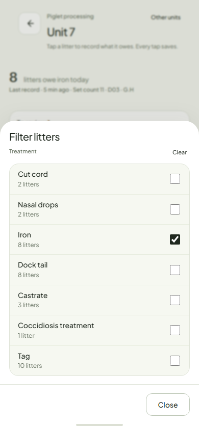 | 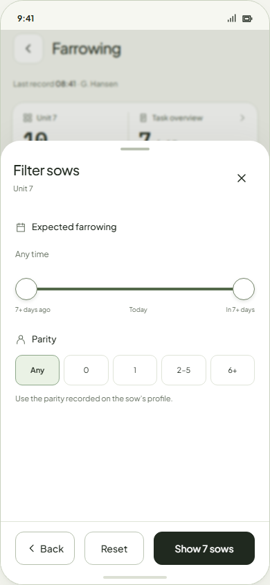 |
|---|---|

- Head: no grab, no ✕, no divider; `Treatment` label and `Clear` in the body instead of a subtitle (`Unit 7`) under the title.
- Footer: a lone right-aligned outlined **Close**. Farrowing: `‹ Back · Reset · Show 7 sows` (the primary names the result).
- The page behind is not inert: 14 controls behind the scrim fail the new tap test (`geo-untappable`, the tap lands on the scrim).

### 03 · Find (`room-find`) → farrowing Find a sow
| 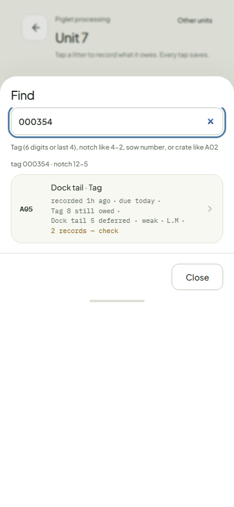 | 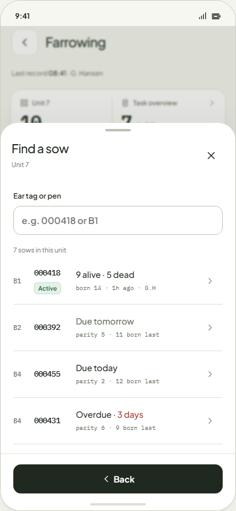 |
|---|---|

- Title `Find` with no subtitle; farrowing `Find a sow` over `Unit 7`, ✕.
- Result row is a Row card with a 4-line mono meta; farrowing reuses the **same sow row** as the room (pen · id + chip · headline · meta).
- Exit: `Close` (small, right) vs farrowing's full-width `‹ Back`.

### 04 · Reviews (`room-reviews`) → *no counterpart* (compose: TaskSheet + TaskRow); nearest anatomy is farrowing's Pen page
| 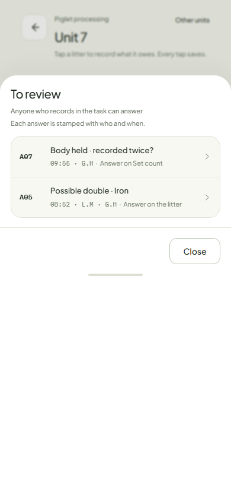 |  |
|---|---|

- A drawer with a title, a two-line instruction and review rows (`Body held · recorded twice?`) with meta; exit `Close`.
- Skeleton: a content-height TaskSheet (`To review` / `2 open`), TaskRows (crate id + chip `review`, headline = the question, meta = who/when), footer Back alone.

### 05 · Litter sheet (`litter.html?state=litter`) → farrowing sow sheet (tap a row), and farrowing's own **Piglet processing** page
| Processing | Farrowing sow sheet | Farrowing piglet processing |
|---|---|---|
| 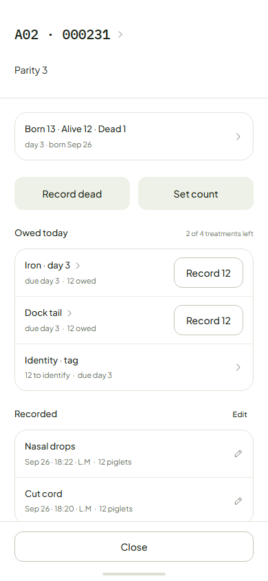 | 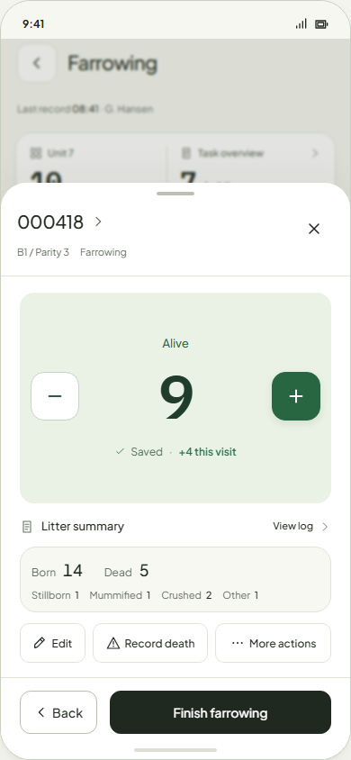 | 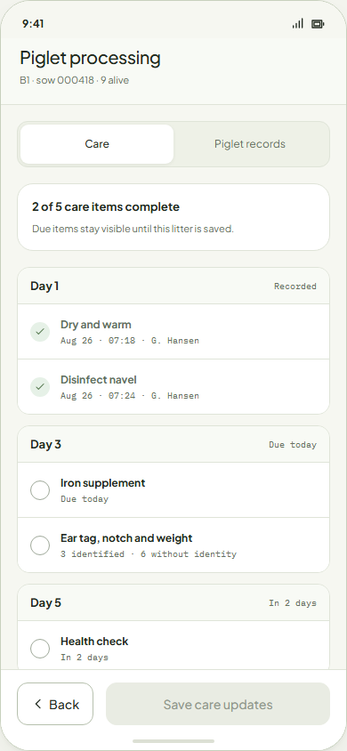 |

- **Presentation:** a page with a litter header (C2). Farrowing opens the litter as a **drawer over the room** whose head is `000418 ›` / `B1 / Parity 3 · Farrowing` / ✕.
- **Summary:** a `Born 13 · Alive 12 · Dead 1` row card; farrowing shows the one figure the task is about (the Alive hero) and a `Litter summary` panel with `View log ›`.
- **Tools:** C7.
- **Grouping:** `Owed today` / `Recorded` sections of Row cards, each with `Record 12` buttons inside the row. Farrowing's own piglet-processing page groups care items **by day** (`Day 1 · Recorded`, `Day 3 · Due today`) as cards with a round check per item — the anatomy processing should reuse for treatments.
- **Exit:** a full-width outlined **Close**. Farrowing: `‹ Back` + `Finish farrowing` (the sheet's one commit).

### 06 · Castrate drawer (`castrate`) → farrowing Dead drawer (steppers per cause)
| 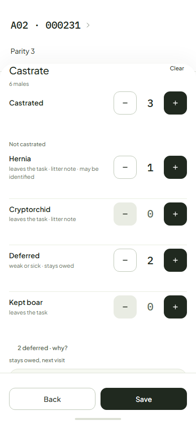 |  |
|---|---|

- Title `Castrate` jammed under the litter header's `Parity 3` (the drawer rises over the litter page), no grab, no ✕, no divider; `Clear` floats top-right at 11px.
- Rows carry a 2-line description each (`leaves the task · litter note · may be identified`); farrowing's rows are one label.
- The `2 deferred · why?` line is indented off the column; content runs under the footer.
- Footer: Back 172px (half) + Save; farrowing Back 86px + Save.

### 07 · Deferred-reasons drawer (`all-deferred`) → farrowing Finish farrowing (a count and a condition)
| 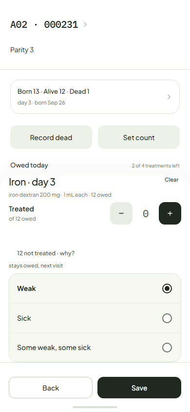 | 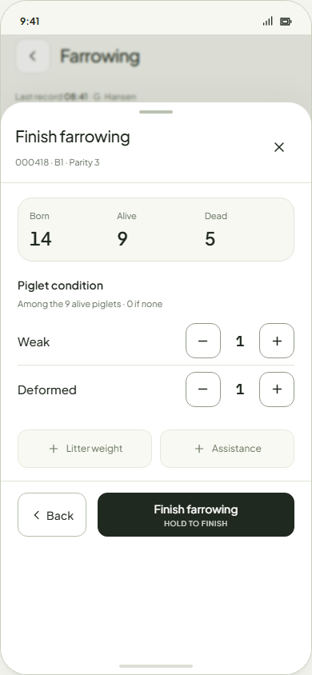 |
|---|---|

- Drawer title `Iron · day 3` with a body sentence as subtitle; a stepper then a radio list inside a second panel. Farrowing: title + subtitle + ✕ + divider, facts panel, condition rows, footer with the hold.
- The reason (`12 not treated - why?`) and its hint are two stacked lines in the body.

### 08 · Arrivals drawer (`arrived-resolve`) → farrowing Correct-born dialog (one question)
| 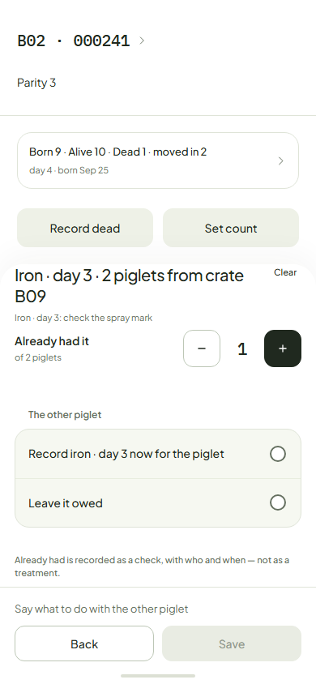 | 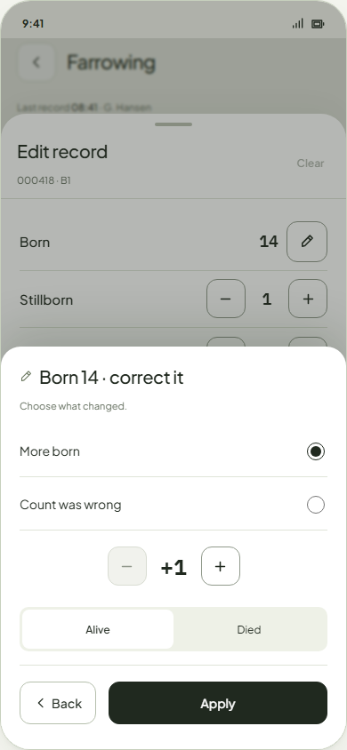 |
|---|---|

- One question drawn as a full drawer with a 2-line title; the answer rows (`Record iron · day 3 now…`, `Leave it owed`) are a radio panel; a trailing explanation paragraph sits above the bar. Farrowing asks one question in a **dialog** (title with glyph, one description line, the choices, Back + Apply).

### 09 · Dead (`dead.html?state=dead`) → farrowing Dead drawer
| 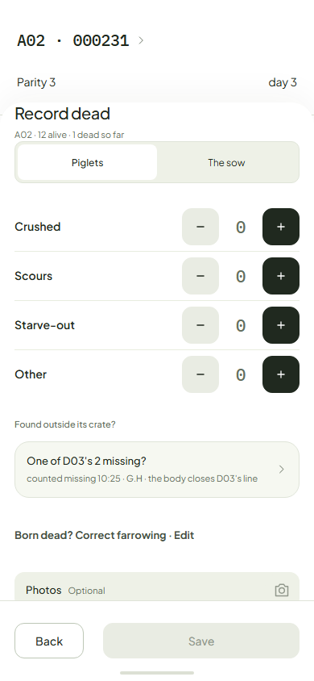 | 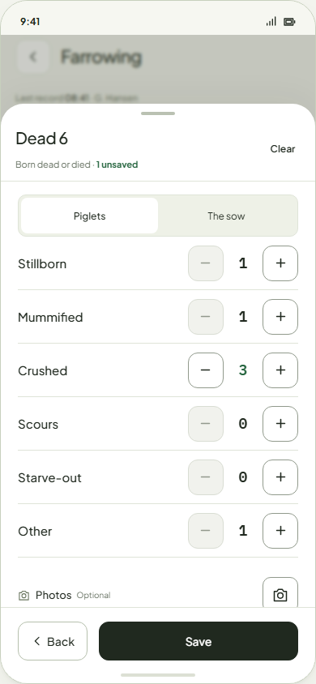 |
|---|---|

- Title `Record dead` + `A02 · 12 alive · 1 dead so far` under the litter header (C2/C3); farrowing `Dead 6` / `Born dead or died · 1 unsaved` with **Clear** where the ✕ sits.
- Extra body: `Found outside its crate?` row card, `Born dead? Correct farrowing · Edit` line, Photos card. Farrowing: segment, the cause steppers, Photos.
- Steppers: processing uses the DS Stepper (filled + key); farrowing outlined keys. (Content, not skeleton; the Stepper card is ADR 0001.)
- Footer matches (Back + Save), but Back has no chevron.

### 10 · Dead · the sow (`dead-sow`) → farrowing Dead drawer, The sow
| 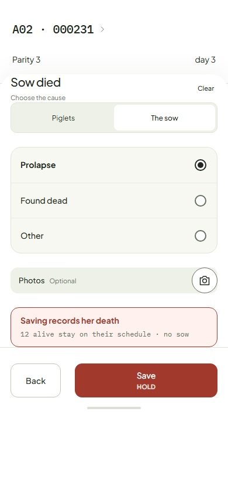 | 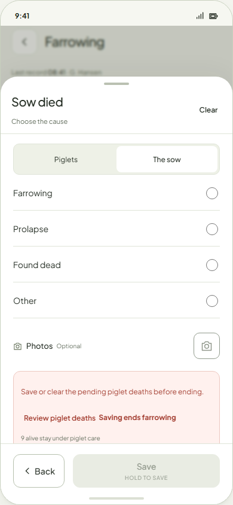 |
|---|---|

- Title `Sow died` / `Choose the cause` under the litter header; a red danger band; the red **Save · HOLD** primary. Farrowing: same drawer (`Sow died` / `Choose the cause`, Clear), the causes, Photos, a pending band, Back + a grey `Save · HOLD TO SAVE`.
- Structural difference is the drawer head (C3) and the footer register (red hold vs ink hold).

### 11 · Set count (`count.html?state=count`) → farrowing Reconcile piglet count (page)
| 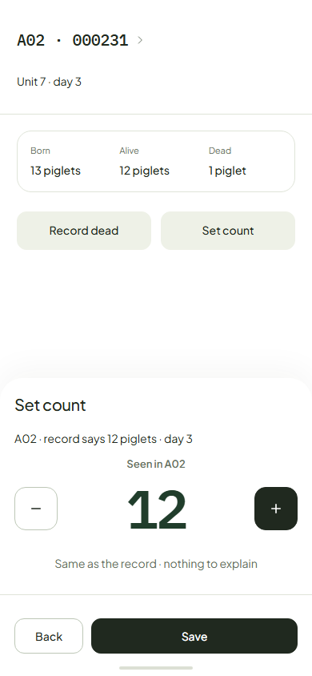 | 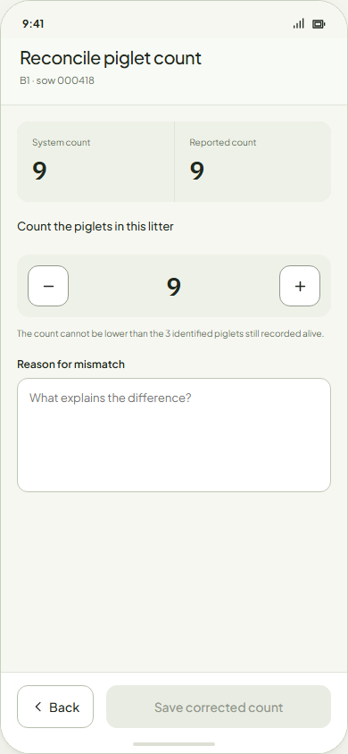 |
|---|---|

- A short drawer over the litter page (the litter's facts and tools show above it); title `Set count`, then `A02 · record says 12 piglets · day 3` as a body line, a label `Seen in A02`, the hero stepper. Farrowing: a **page** `Reconcile piglet count` / `B1 · sow 000418`, a two-fact panel (system | reported), the stepper on a well, the rule line, Back + `Save corrected count`.
- Footer fine (Back + Save), no chevron.

### 12 · Explain a count (`explain`) → *no counterpart* (compose: TaskPage + TaskGroup/TaskRow door rows); nearest anatomy is farrowing's Pen page
| 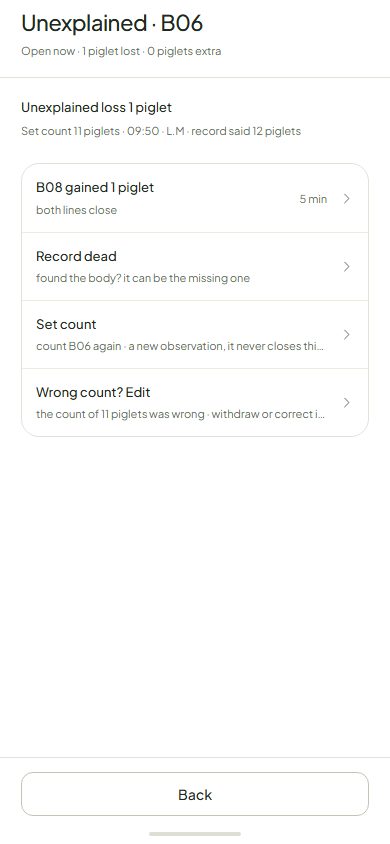 | 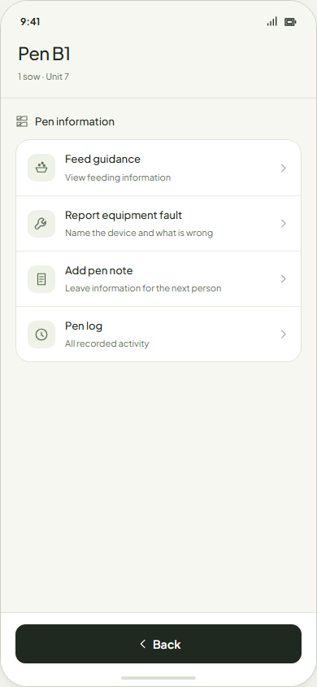 |
|---|---|

- Page title `Unexplained · B06` with no status bar; a bold lead line and a sub-line; door rows with truncated 2-line descriptions (`count B06 again - a new observation, it never closes thi…`).
- Skeleton: TaskPage head (`Unexplained loss 1` / `B06 · set count 11 · 09:50 · L.M`), a panel of door rows (one headline, one meta line), Back alone.

### 13 · Move (`move.html?state=move`) → farrowing Foster piglets (page)
| 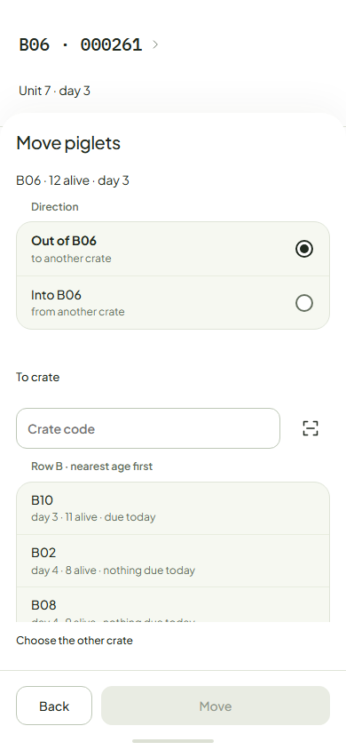 | 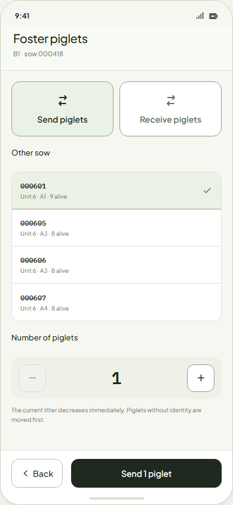 |
|---|---|

- A drawer over the litter page; direction as a radio panel; `To crate` field + scan; a crate list in its own scrolling box; a status line above the bar. Farrowing: a page `Foster piglets` / `B1 · sow 000418`; direction as two big choice tiles; `Other sow` list with a ✓; `Number of piglets` stepper; one rule line; Back + `Send 1 piglet`.
- The primary names the act and count in farrowing; processing's is `Move` (waiting).

### 14 · Identity entry (`id.html?state=id-entry`) → farrowing Piglet identity (page)
| 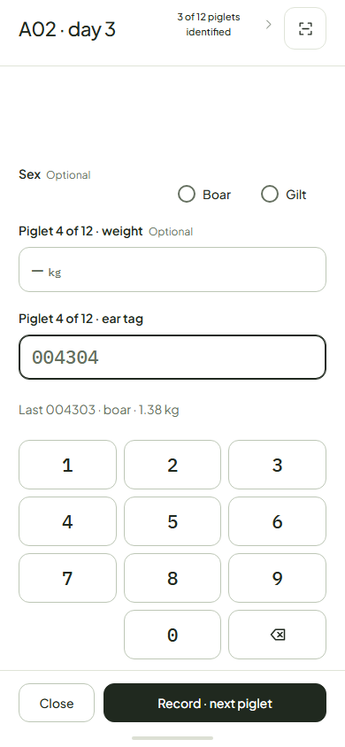 | 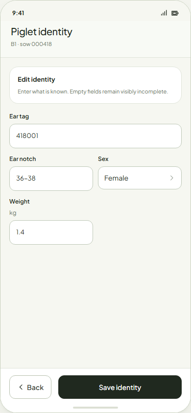 |
|---|---|

- Header is `A02 · day 3` with `3 of 12 piglets identified ›` crammed right and a scan icon; no status bar, no page head divider style; fields then a full Numpad. Farrowing: page head `Piglet identity` / `B1 · sow 000418`, a panel of fields, Back + `Save identity`.
- Exit **Close** (farrowing Back). The Numpad is content (ADR 0001).

### 15 · Identity table (`id-table`) → farrowing Piglet records (page, tab)
| 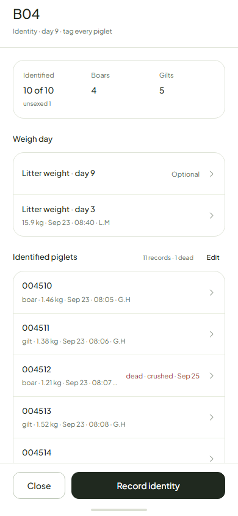 | 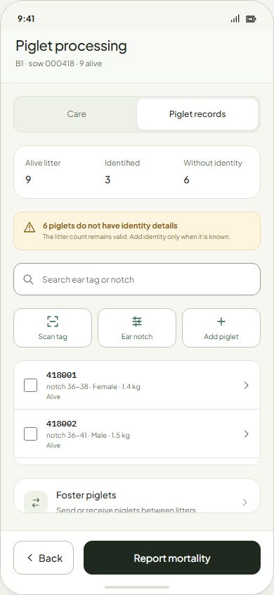 |
|---|---|

- Title `B04` with `Identity · day 9 · tag every piglet` as a subtitle, no status bar; facts panel; `Weigh day` rows; identified piglets list with an `Edit` text action. Farrowing: page head, Care | Piglet records segment, facts, a warning band, search, tools, piglet rows (id + meta + chevron), Back + `Report mortality`.
- Exit **Close** + `Record identity`.

### 16 · Record page (`edit.html?state=record-page`) → farrowing Farrowing log
| 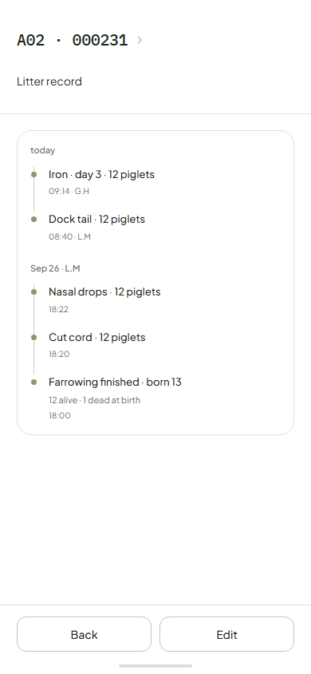 | 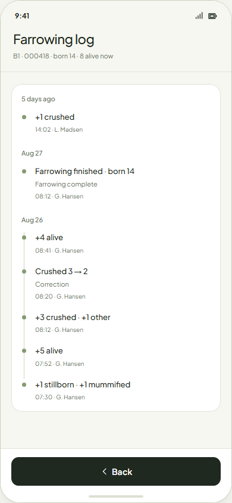 |
|---|---|

- Head is the litter header (`A02 · 000231 ›` over `Litter record`) instead of a page title (`Farrowing log`) over one description line.
- The log panel matches (DS Log).
- Footer: `Back | Edit` split 50/50 as outlined buttons. Farrowing: Back alone, filled; Edit is reached from the sheet's tool row.

### 17 · Edit (`edit.html?state=edit`) → farrowing Edit record drawer
| 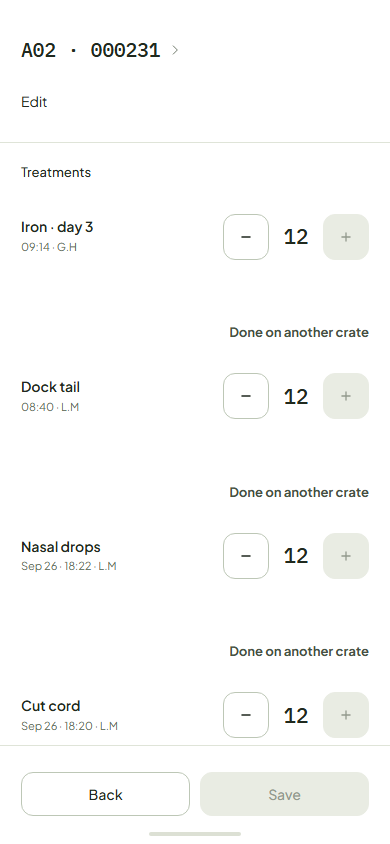 | 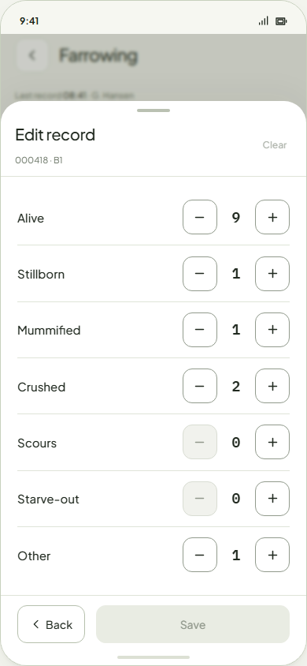 |
|---|---|

- A page with the litter header and `Edit` as a subtitle; each row has a second line (stamp) and a `Done on another crate` text action on its own 44px line under it — the rows are 150px apart. Farrowing: a drawer `Edit record` / `000418 · B1`, Clear, one stepper per 70px row.
- Footer: Back 50% + Save 50%; farrowing Back 86 + Save.

### 18 · Task overview (`end.html?state=overview`) → farrowing Task overview (page)
| 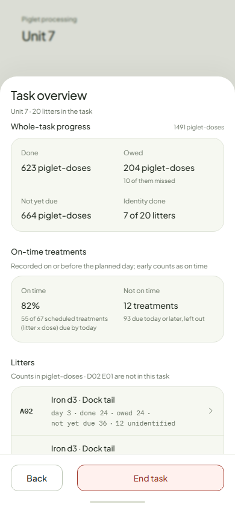 | 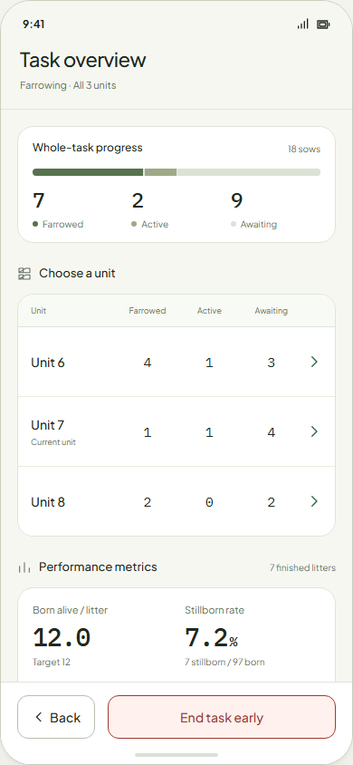 |
|---|---|

- Drawn as a **drawer** over the room; farrowing's overview is a **page** with a status bar.
- Head: `Task overview` / `Unit 7 · 20 litters in the task`; then `Whole-task progress` as a section label with a 2×2 facts panel of piglet-doses. Farrowing: `Task overview` / `Farrowing · All 3 units`; a progress card (bar + 3 counts), `Choose a unit` table, `Performance metrics`.
- Litters at the bottom as Row cards with 3-line meta (C6).
- Footer matches (Back + `End task` in red-wash).

### 19 · End review (`end-review`) → farrowing End task early (page)
|  |  |
|---|---|

- A drawer (not a page); four stacked panels (a count panel, a red band, a 2×2 facts panel, an `Open for review` section). Farrowing: page head, one warning card (`9 sows will be removed…` ›), `Performance metrics`, `Task outcomes`, and the red hold.
- The hold matches in place (Back + red `End task · Hold to end`).

### 20 · End hold (`end-hold`) → farrowing Complete task (hold)
| 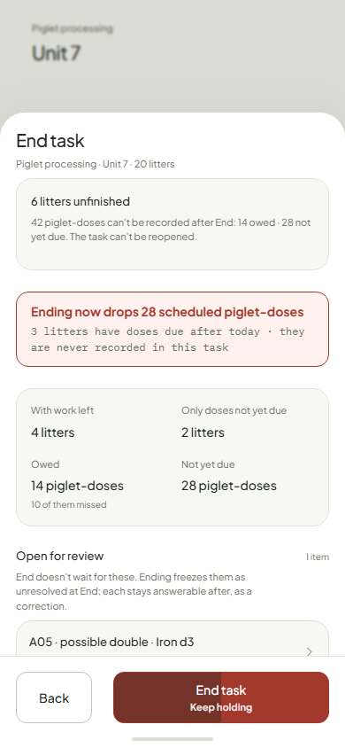 | 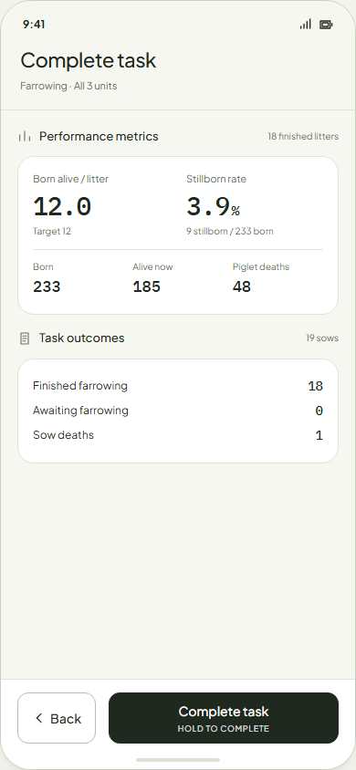 |
|---|---|

- Same drawer-not-page difference. Hold face: processing's caption `Keep holding` 11px sentence case; farrowing's `HOLD TO COMPLETE` 9px capitals (see farrowing bugs).

### 21 · End receipt (`receipt`) → farrowing's end receipt (`roomTaskReceipt`, not reachable in a capture) — nearest: the record page
| 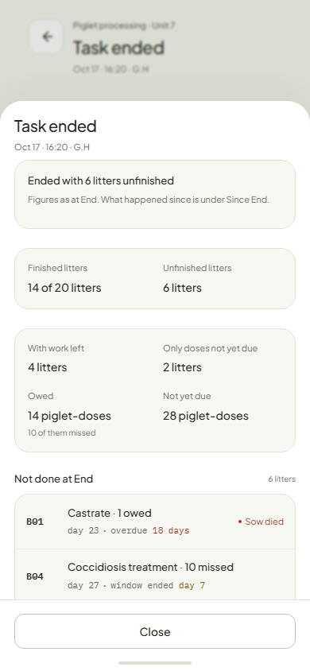 |  |
|---|---|

- A drawer over a blurred header that says `Task ended`; three panels; a `Not done at End` list of Row cards; exit **Close**.
- Skeleton: TaskPage (`Task ended` / `Oct 17 · 16:20 · G.H`), panels, TaskGroup of TaskRows, Back alone.

### 22 · Weaning handoff (`weaning-handoff`) → *no counterpart* (compose: TaskPage + summary panel + TaskGroup/TaskRow)
| 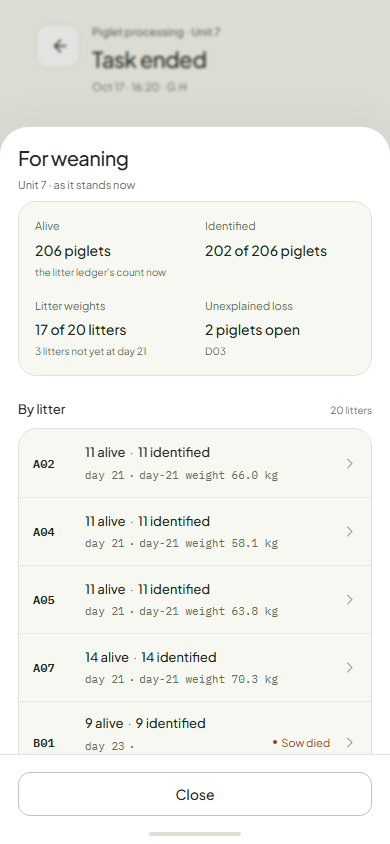 |  |
|---|---|

- Drawer over the ended room; `For weaning` / `Unit 7 · as it stands now`; facts panel; `By litter` Row cards (`11 alive · 11 identified`, meta `day 21 · day-21 weight 66.0 kg`), exit **Close**.
- The rows are closest to parity already (figure headline) but keep the right-side `• Sow died` dot and no chip.

### 23 · Bulk (`bulk.html?state=bulk-select`) → *no counterpart* (compose: TaskPage + TaskGroup + TaskRow with a checkbox trail); nearest anatomy is the room list
| 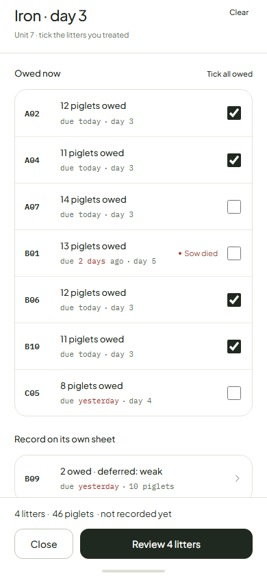 |  |
|---|---|

- No status bar; head `Iron · day 3` / `Unit 7 · tick the litters you treated`, `Clear` top-right; flat list with checkboxes on the right; a status line (`4 litters · 46 piglets · not recorded yet`) in the bar; exit **Close** + `Review 4 litters`.
- Skeleton: rows grouped by crate row, the chip slot for `Sow died`, the tick as the row's trail, the status line moved into the page head's description, Back + `Review 4 litters`.

### 24 · Bulk review (`bulk-review`) → farrowing End task early (a review before a commit)
| 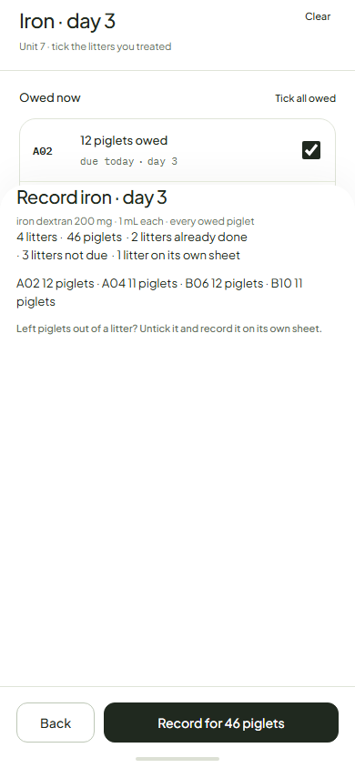 | 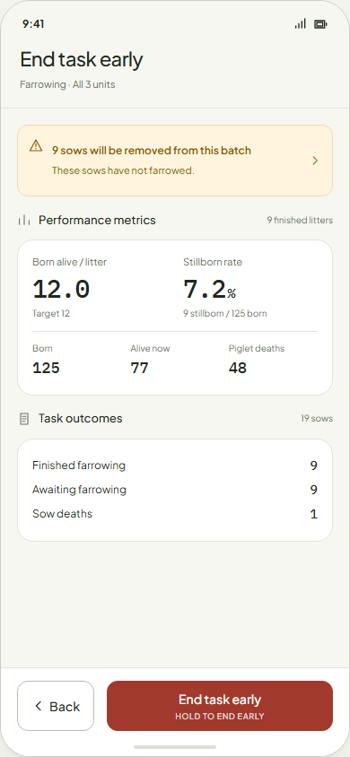 |
|---|---|

- A drawer with a dense paragraph block (`Iron dextran 200 mg · 1mL each · every owed piglet / 4 litters · 46 piglets · 2 litters already done / …`). Farrowing reviews with a titled card and facts, then the commit.

### 25 · Litter outside the task (`edge.html?state=no-task`) → farrowing Locked record (sheet)
| 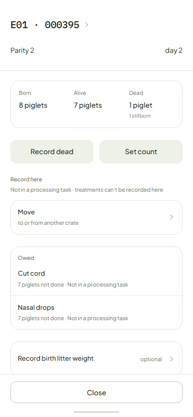 | 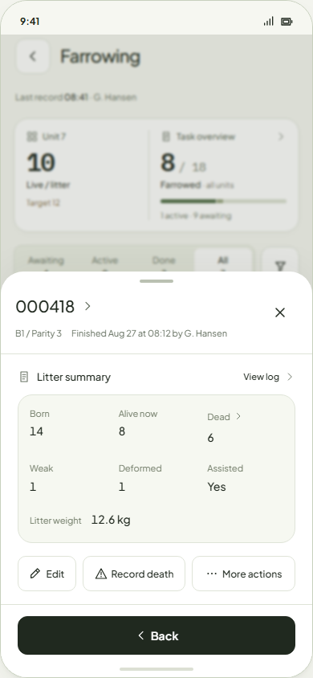 |
|---|---|

- Litter page header (C2), facts row card, tool tiles (C7), `Record here` section of door rows, `Owed` panel with explanatory meta; exit **Close**. Farrowing: the sheet head (`000418 ›` / `B1 / Parity 3 · Finished …`), `Litter summary` panel, tool row, Back (filled).

### 26 · Birth litter weight (`birth-weight-entry`) → farrowing Finish farrowing (Litter weight)
| 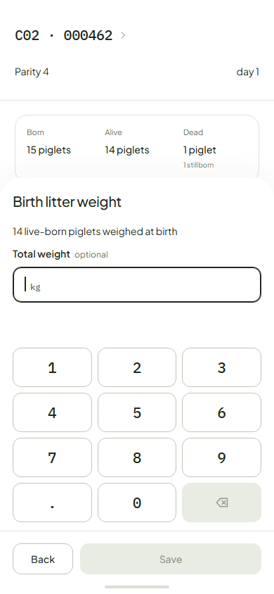 |  |
|---|---|

- A drawer with no grab/✕/divider over the litter page; `Total weight · optional` field + Numpad; Back + Save (waiting). Farrowing takes litter weight as an optional detail inside the Finish sheet.

## Farrowing's own bugs (reported, not fixed in the reference)

Found by the new lint rules (run on the reference's presets) and by measuring the phone at 390×844.

1. **Finish farrowing: the footer floats.** The sheet is held at 85% (`data-size="long"` → `height: 85%`) but its body does not grow, so Back / Finish farrowing end **144px above** the sheet's bottom edge over dead white space (`geo-footer-float` 144px, `geo-sheet-dead-space` 144px: 716px sheet for 572px of content). The skeleton sizes drawers to their content and keeps the footer last.
2. **Filter sows: 148px of dead space** between the parity chips and the footer (640px sheet for 492px of content).
3. **Two left edges in every drawer and every page, reversed.** Drawer head at 18px, drawer body and footer at 21px (the title sits 3px left of everything under it). Page head at 21px, page body and footer at 18px (the title sits 3px right of the panel under it). The skeleton uses one edge per surface: 21 in drawers, 18 on pages (the room's edge).
4. **The hold caption is 9px capitals** (`HOLD TO FINISH`, `HOLD TO SAVE`, `HOLD TO END EARLY`): below the 10px type floor and against sentence case; ADR 0002's ruled face is 11px/700 sentence case. The skeleton uses the ruled face.
5. **"Complete" is on screen**: the End task sheet for an all-finished batch is `Complete task · HOLD TO COMPLETE`, and the piglet page says `2 of 5 care items complete`. `Complete` is banned in `ux/laws/strings.json`.
6. **A lone Back looks like a commit.** On the record page, the locked sheet and Find a sow, Back alone is filled `ink` — the primary's face — while the README says every primary is ink. It reads as the sheet's action.
7. **Status chips are filled badges** (`Active` green, `Done` grey, `Sow died` red, each tinted with a border), while the design-system README says status words are coloured text with a 4px dot, *never filled badges*. The reference and the law disagree (owner decision below).
8. **The scrim stays live under a dialog.** With Correct born open, the drawer is `inert` but its scrim button is not: it stays in the tab order behind the dialog (`geo-untappable`). The dialog's footer also ends 28px above the dialog's edge (padding), which the new footer rule reads as a float.
9. **Off-token values** (lint on the studio page: 75 errors): text colours `#394432`, `#8a672c`, `#738069`, `#748068`, `#6e7965`; chip tints; progress segments `#57724e` / `#9daa87` / `#dce2d4`; sizes 31, 15, 10.5, 9.5, 9px; radii 7 and 34; paddings 13 and 15. The skeleton maps each to a token or a candidate token (ADR 0003).

## Owner decisions this inventory raises

See ADR 0003, *Open questions*. In short: (a) does a litter open as a drawer over the room (farrowing) or as its own page (processing today)? (b) filled chips or dotted status words? (c) a lone Back — filled or outlined? (d) the hold caption face; (e) the skeleton's candidate tokens.
